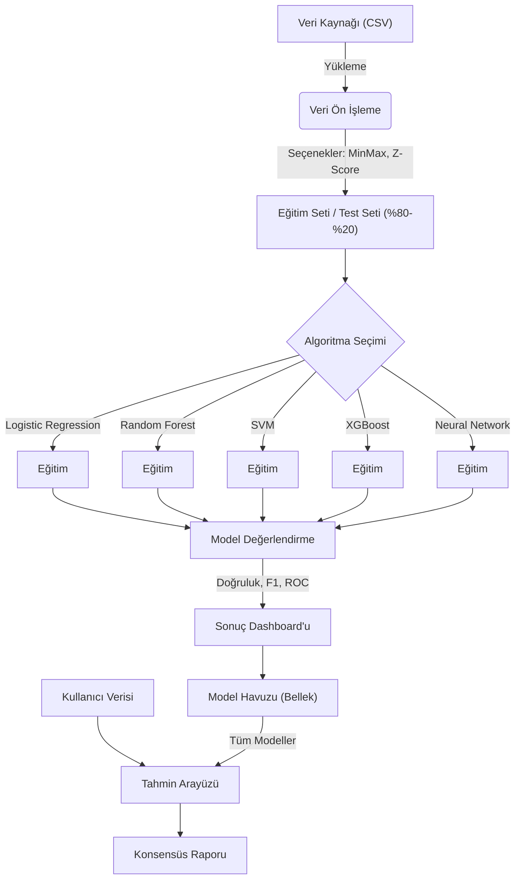

# Heart Disease Checker - Proje Raporu

## 1. Proje Özeti
Bu proje, Kalp Hastalığı veri setini kullanarak makine öğrenimi modelleri eğiten, kıyaslayan ve bu modelleri klinik bir karar destek sistemi olarak kullanan bir masaüstü uygulamasıdır. `ML.NET` ve `Avalonia UI` teknolojileri kullanılarak geliştirilmiştir.

Uygulamanın temel amacı, farklı sınıflandırma algoritmalarının başarısını ölçmek ve kullanıcılara kendi sağlık verileri üzerinden risk analizi yapma imkanı sunmaktır.

---

## 2. İş Akışı (Workflow)

---

## 3. Veri Profili
Kullanılan veri seti (Cleveland Heart Disease), kalp hastalığı teşhisi için kritik 13 özellikten (biz 7 tanesini kullanıyoruz) oluşur.

| Sütun Adı | Açıklama | Tip | Örnek |
|-----------|----------|-----|-------|
| **Age** | Hastanın yaşı | Sayısal | 63 |
| **Gender** | Cinsiyet (1: Erkek, 0: Kadın) | Kategorik | 1 |
| **CP** | Göğüs Ağrısı Tipi (0-3) | Kategorik | 0 (Tipik Anjina) |
| **Trestbps** | İstirahat Kan Basıncı | Sayısal | 145 mm/Hg |
| **Chol** | Serum Kolesterol | Sayısal | 233 mg/dl |
| **Fbs** | Açlık Kan Şekeri > 120 (1: Evet, 0: Hayır) | Kategorik | 1 |
| **Restecg** | İstirahat EKG Sonucu | Kategorik | 0 |
| **Thalach** | Maksimum Kalp Atış Hızı | Sayısal | 150 |
| **Exang** | Egzersizle İndüklenen Anjina (1: Evet) | Kategorik | 0 |
| **Oldpeak** | ST Depresyonu | Sayısal | 2.3 |
| **Slope** | ST Segment Eğimi | Kategorik | 0 |
| **Ca** | Renklendirilen Büyük Damar Sayısı | Sayısal | 0 |
| **Thal** | Talasemi | Kategorik | 1 |
| **Target** | Kalp Hastalığı Riski (0: Yok, 1: Var) | Hedef | 1 |

---

## 4. Kullanılan Algoritmalar

### A. Lojistik Regresyon (Logistic Regression)
*   **Mantık:** Verilerin bir sınıfa ait olma olasılığını `Sigmoid` fonksiyonu kullanarak hesaplar. Doğrusal bir karar sınırı çizer.
*   **Avantajı:** Hızlıdır, yorumlanabilirliği yüksektir.
*   **Kullanım:** Temel referans (baseline) modeli olarak kullanılır.

### B. Rastgele Orman (Random Forest)
*   **Mantık:** Birden fazla Karar Ağacı (Decision Tree) eğitir ve bu ağaçların "oy çokluğu" ile karar verir (Ensemble Learning).
*   **Avantajı:** Overfitting'e (aşırı öğrenme) karşı dirençlidir, karmaşık ilişkileri yakalar.
*   **Kullanım:** Genellikle en yüksek doğruluğu veren modeldir.

### C. Destek Vektör Makineleri (SVM)
*   **Mantık:** Veri noktalarını sınıflara ayırmak için en uygun "hiper-düzlemi" (hyperplane) bulur.
*   **Avantajı:** Yüksek boyutlu verilerde etkilidir.
*   **Kullanım:** Marjinal vakaları ayırt etmede iyidir.

### D. Yükseltilmiş Karar Ağaçları (XGBoost / FastTree)
*   **Mantık:** Hatalı tahmin yapan ağaçların hatalarını düzeltmek üzere sıralı (boosting) ağaçlar kurar.
*   **Avantajı:** Yarışmalarda sıkça kullanılan, performansı çok yüksek bir yöntemdir.

---

## 5. Sağlanan Özellikler ve Fazlar
Proje aşağıdaki sırayla geliştirilmiştir:

1.  **Mimari Refactoring:** Kod tabanı `Models` ve `Services` olarak modüler hale getirildi.
2.  **Ön İşleme (Preprocessing):** Kullanıcıya Min-Max ve Z-Score normalizasyon seçenekleri sunuldu.
3.  **Algoritma Seçimi:** Kullanıcı hangi modellerin eğitileceğini seçebilir hale geldi.
4.  **Görselleştirme:**
    *   Confusion Matrix (Isı Haritası)
    *   ROC Eğrileri
    *   Kutu grafikleri (Box Plots)
5.  **Çoklu Karar Destek Sistemi:** Tek bir model yerine, eğitilmiş tüm modellerin ortak kararı (Ensemble Inference) kullanılarak güven skoru hesaplandı.
